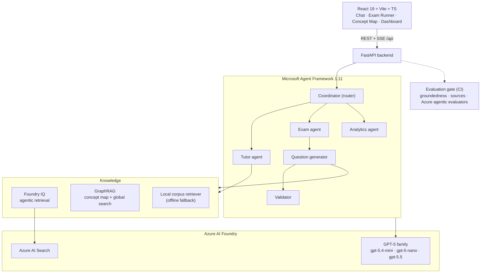

<div align="center">

# 🎓 AI Exam Assistant

**An open-source, multi-agent study companion built on the latest Microsoft AI stack.**

Microsoft Agent Framework · Azure AI Foundry (Foundry IQ agentic retrieval) · GraphRAG · Agent evaluations in CI

[](LICENSE)
[](backend/pyproject.toml)
[](https://github.com/microsoft/agent-framework)
[](https://github.com/microsoft/graphrag)
[](#-quickstart-offline--no-azure-no-keys)

</div>

---

## What is this?

**AI Exam Assistant** turns any study corpus (certification syllabus, course notes, a textbook) into a grounded, multi-agent tutor that:

- 💬 **answers questions** strictly from the material, always citing its sources;
- 📝 **generates and grades adaptive practice exams** with traceable, non-invented questions;
- 🗺️ **builds a concept map** of the syllabus with **GraphRAG**, so students can *see* how topics connect and get true syllabus-wide ("what are the main themes?") answers a vanilla RAG chatbot can't;
- 📊 **coaches** the learner by spotting weak topics and proposing a focus plan.

It ships with a ready-to-index demo corpus for the **Microsoft Azure Fundamentals (AZ-900)** certification, and a **fully offline mode** so you can clone and run it in under a minute with **no Azure account and no API keys**.

> This is a reference **accelerator**, not a SaaS product — intentionally free of auth/billing/multi-tenant plumbing so the interesting parts (agents, retrieval, evaluation) stay front and centre.

---

## Why it's different

| Most RAG chatbots | AI Exam Assistant |
|---|---|
| Single LLM call over top-k chunks | **Multi-agent orchestration** (coordinator → tutor / exam / analytics) on Microsoft Agent Framework |
| Answers may drift or invent | **Grounded + cited** everywhere; questions validated against the source |
| Can't answer "what are the main topics?" | **GraphRAG global search** + a visual **concept map** |
| "Trust me" quality | **Agent evaluation gate in CI** (groundedness, sources, and optional Azure agentic evaluators) |
| Bring-your-own cloud to even try it | **Runs offline** with zero credentials; scales up to full Azure Foundry |

---

## Architecture



**Model roles** (GPT-5 family only; EU Data Zone): `gpt-5.4-mini` tutor · `gpt-5-nano` routing + cheap GraphRAG extraction · `gpt-5.5` deep validation · `gpt-5-mini` evaluation judge · `text-embedding-3-large` embeddings.

See **[ARCHITECTURE.md](ARCHITECTURE.md)** for the full design, the query-mode strategy (Local / Global / DRIFT), and the grounded question-generation pipeline.

---

## 🚀 Quickstart (offline — no Azure, no keys)

```bash
git clone https://github.com/Nambu89/AI_Exam_Assistant.git
cd AI_Exam_Assistant

# Backend (offline mode = deterministic, credential-free)
python -m venv .venv && source .venv/bin/activate      # Windows: .venv\Scripts\activate
pip install -e "backend[dev]"
MODEL_PROVIDER=local uvicorn app.main:app --app-dir backend --port 8000

# Frontend (in a second terminal)
cd frontend && npm install && npm run dev              # http://localhost:5173
```

In offline mode the tutor answers extractively from the corpus, exams are built by the
deterministic grounded question builder, and the concept map is generated by a
co-occurrence graph — so every screen works with **no model calls**.

Run the tests and the evaluation gate:

```bash
cd backend && pytest                                   # 33 offline tests
python evals/run_eval.py --gold ../data/eval/gold_qa.jsonl --out report.json
```

---

## ☁️ Full Microsoft mode (Azure AI Foundry)

```bash
azd up          # provisions Foundry + AI Search + Container Apps + Key Vault + observability
```

Then set `MODEL_PROVIDER=foundry` and point the app at your Foundry project. This unlocks:
GPT-5 reasoning, **Foundry IQ** agentic retrieval, real **GraphRAG** indexing (`python -m app.ingest && graphrag index --root backend/graphrag`), and the framework-native orchestration patterns (Handoff / Concurrent / Magentic) in `app/agents/af_orchestration.py`.

Infra lives in [`infra/`](infra) (Bicep) and [`azure.yaml`](azure.yaml). Every credential is a
managed identity — **no keys in source**. Config reference: [`backend/.env.example`](backend/.env.example).

---

## The evaluation gate 🧪

Agents are tested like code. `backend/evals/run_eval.py` runs the gold Q&A set through the
orchestrator and enforces thresholds (groundedness + source citation), failing the build if
quality regresses. On PRs, `.github/workflows/agent-eval.yml` runs it against Azure and can also
invoke Microsoft's official [`ai-agent-evals`](https://github.com/microsoft/ai-agent-evals) action
(Intent Resolution, Task Adherence, Tool Call Accuracy…). Details: [`backend/evals/README.md`](backend/evals/README.md).

---

## Project status & honesty

This repo was built and **verified in offline mode** (33 backend tests + the evaluation gate pass;
`az bicep build` is clean). The **Azure/GPT-5 cloud path is written to the verified July-2026 APIs but
has not been run end-to-end against a live Foundry resource here** — treat the cloud code as a
faithful, well-isolated reference to validate against your subscription. Two API surface details in
Agent Framework 1.11 were still stabilising at build time and are isolated in
`app/clients/agent_factory.py` with fallbacks (see [ARCHITECTURE.md](ARCHITECTURE.md#version-notes)).

The demo corpus under [`data/corpus/az-900`](data/corpus/az-900) is **original study material** written
for this project (MIT-licensed like the rest); it is a study aid, not official Microsoft content.

---

## Repository layout

```
backend/     FastAPI app · agents · knowledge (Foundry IQ / GraphRAG / local) · evals
frontend/    React 19 + Vite + TS + Tailwind v4 (chat, exam, concept map, dashboard)
data/        demo corpus (AZ-900) + gold evaluation set
infra/       Bicep modules + azure.yaml (azd up)
docs/        API contract + design docs
.github/     CI (offline tests) + agent-evaluation gate
```

## Contributing

See [CONTRIBUTING.md](CONTRIBUTING.md). Issues and PRs welcome.

## License

[MIT](LICENSE) © 2026 Fernando Prada ([@Nambu89](https://github.com/Nambu89))

<div align="center"><sub>Built to show what a modern, grounded, evaluated multi-agent app looks like on Microsoft's 2026 AI stack.</sub></div>
